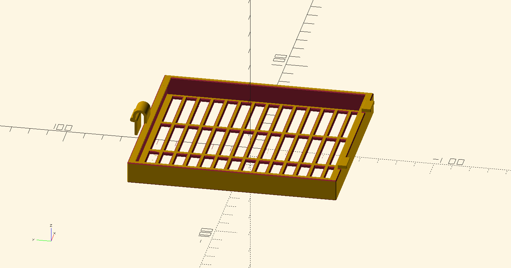
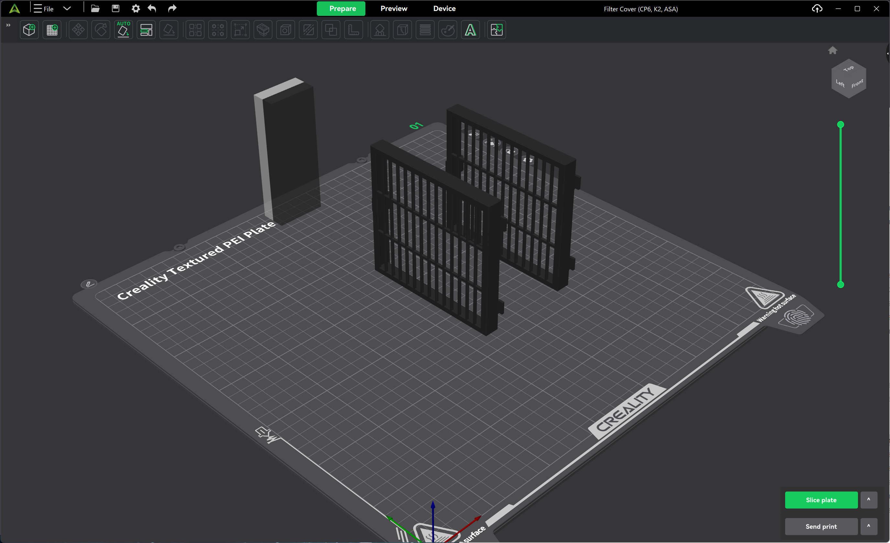

# K2 Exhaust Fan Extended Cover

An extended cover for the Creality K2 Plus exhaust fans that supports a 10cm x 11cm filter.

## Printing Notes
1. The cover should be printed with a material capable of withstanding the environment used in printing. PLA is too brittle and temperature sensitive, and should never be used. If normally printing with low temp filaments, then PETG should be sufficient. If printing with high temp filaments then ABS or ASA is a better choice.

2. The cover must be printed on its side. Printing it with the grill laying on the bed will cause the U clip to break when you try to install it. 

3. Due to its vertical height and thin profile, the part can warp when printing if care is not taken. Ensure adequate support, prevent drafts, and use correct filament settings.

4. To ensure easy removal of the supports without damaging the clip or feet, a compatible support filament is recommended for the interface layers.

## Filter

I used the following filter, but not the black pre-filter.
https://www.aliexpress.us/item/3256805557384214.html

## OpenSCAD Setup

To modify the model, you will need:
* OpenSCAD - https://openscad.org/
* BOSL2 - https://github.com/BelfrySCAD/BOSL2/
